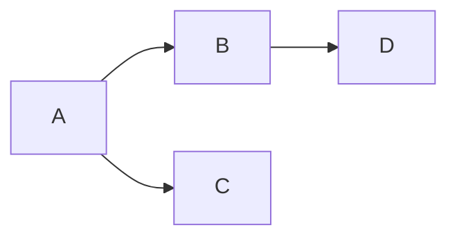
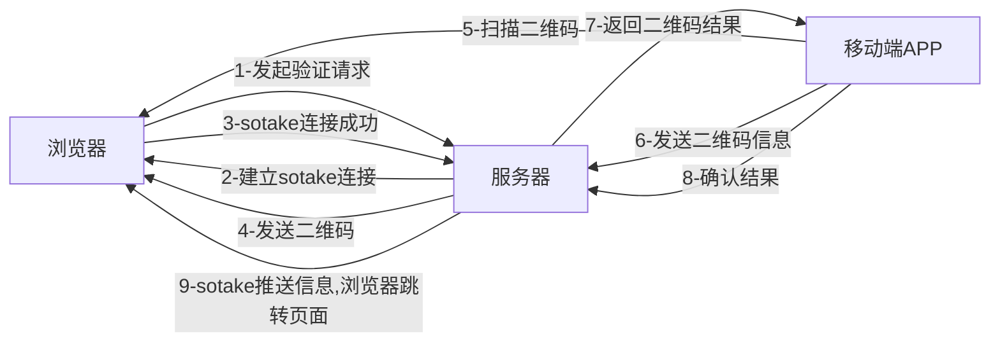
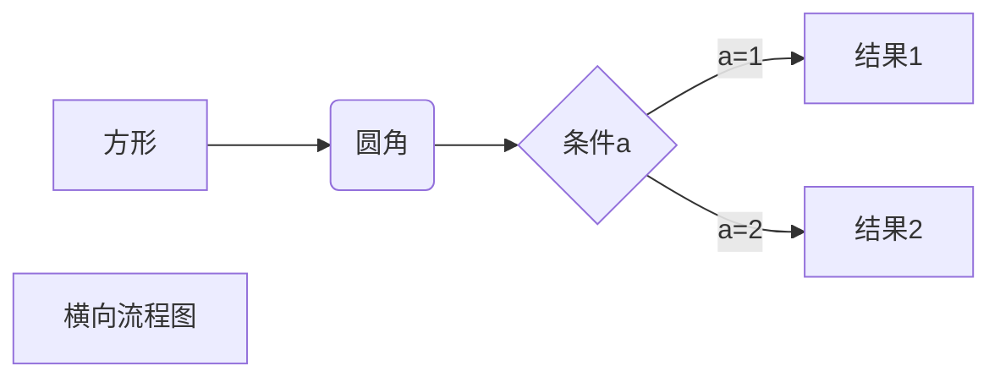
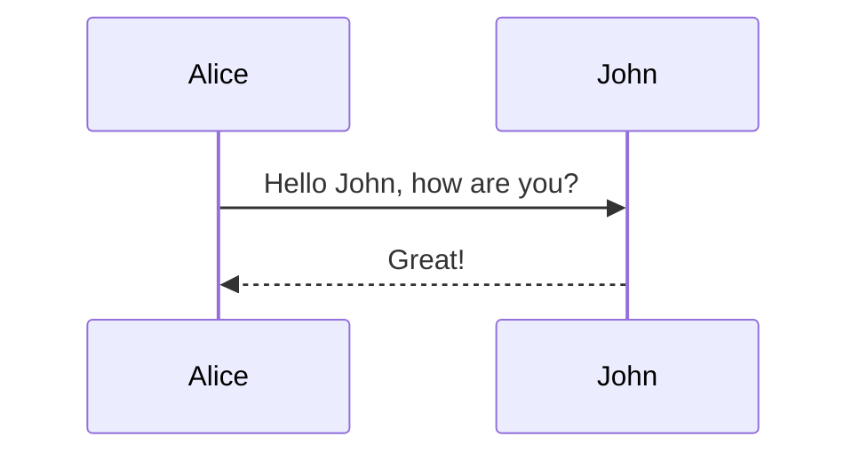
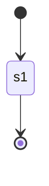
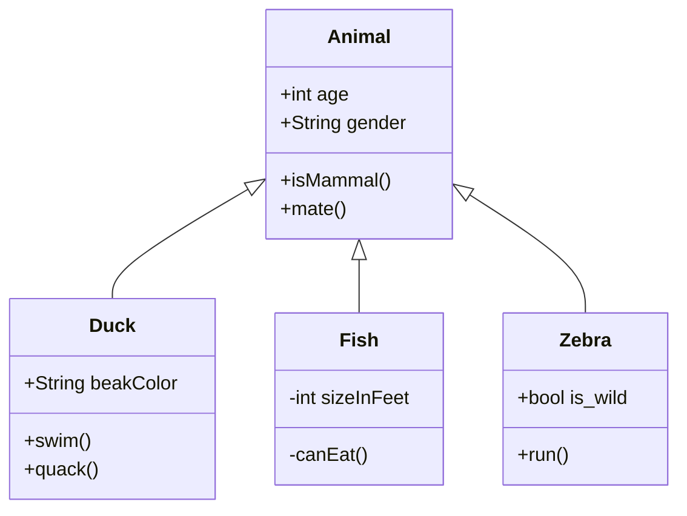
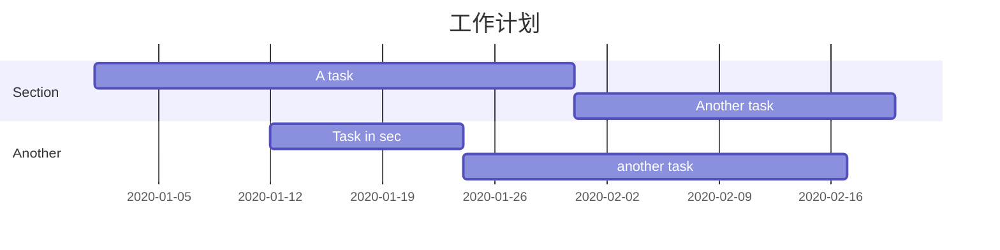
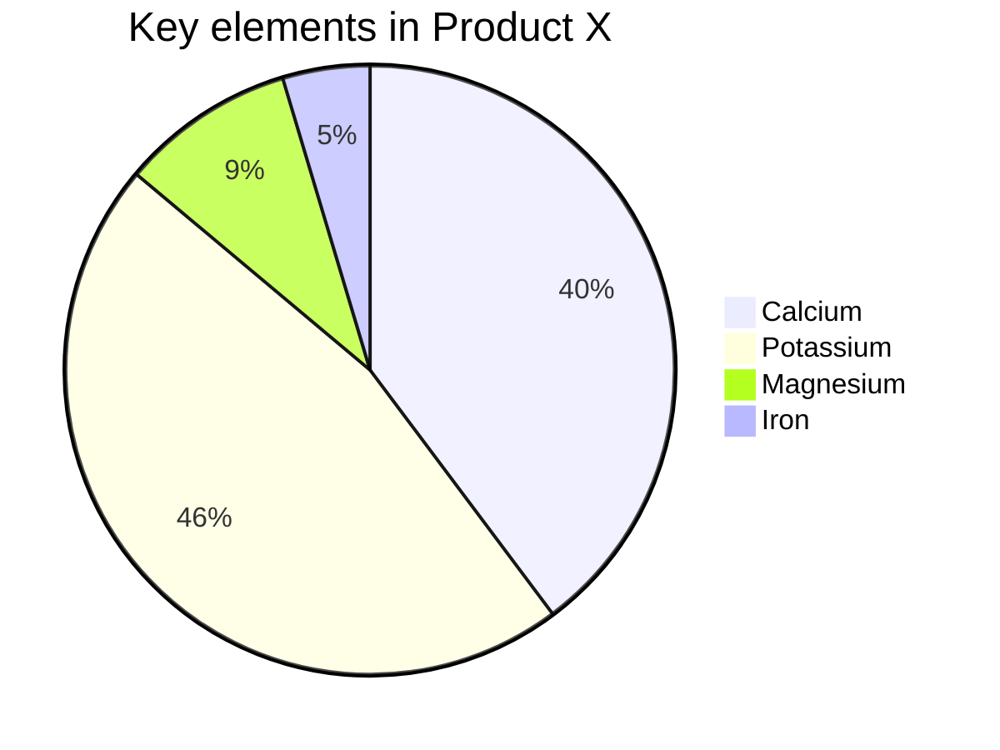

# 使用typora画图

## 流程图

```
graph LR;           //TD 表示的是方向，这里的含义是 Top-Down 由上至下 LR Left-Right
    A-->B;
    A-->C;
    B-->D;
```




```
graph LR            //更加详细的
a[浏览器]            //每个结点的内容
b[服务器]
c[移动端APP]

a-->|1-发起验证请求|b       //结点结点指向
b-->|2-建立sotake连接|a
a-->|3-sotake连接成功|b
b-->|4-发送二维码|a
c-->|5-扫描二维码|a
c-->|6-发送二维码信息|b
b-->|7-返回二维码结果|c
c-->|8-确认结果|b
b-->|9-sotake推送信息,浏览器跳转页面|a
```



```
graph LR
A[方形] -->B(圆角)
    B --> C{条件a}
    C -->|a=1| D[结果1]
    C -->|a=2| E[结果2]
    F[横向流程图]
```




## 时序图

> 语法解释：`->>` 代表实线箭头，`-->>` 则代表虚线。

```
sequenceDiagram
    Alice->>John: Hello John, how are you?
    John-->>Alice: Great!
```



## 状态图

> 语法解释：`[*]` 表示开始或者结束，如果在箭头右边则表示结束。

```
stateDiagram
    [*] --> s1
    s1 --> [*]
```



## 类图

> 语法解释：`<|--` 表示继承，`+` 表示 `public`，`-` 表示 `private`，学过 Java 的应该都知道。

```
classDiagram
      Animal <|-- Duck
      Animal <|-- Fish
      Animal <|-- Zebra
      Animal : +int age
      Animal : +String gender
      Animal: +isMammal()
      Animal: +mate()
      class Duck{
          +String beakColor
          +swim()
          +quack()
      }
      class Fish{
          -int sizeInFeet
          -canEat()
      }
      class Zebra{
          +bool is_wild
          +run()
      }
```



## 甘特图

> 甘特图一般用来表示项目的计划排期，目前在工作中经常会用到。

> 语法也非常简单，从上到下依次是图片标题、日期格式、项目、项目细分的任务。

```
gantt
    title 工作计划
    dateFormat  YYYY-MM-DD
    section Section
    A task           :a1, 2020-01-01, 30d
    Another task     :after a1  , 20d
    section Another
    Task in sec      :2020-01-12  , 12d
    another task      : 24d
```



## 饼图

> 饼图使用 `pie` 表示，标题下面分别是区域名称及其百分比。

```
pie
    title Key elements in Product X
    "Calcium" : 42.96
    "Potassium" : 50.05
    "Magnesium" : 10.01
    "Iron" :  5
```



